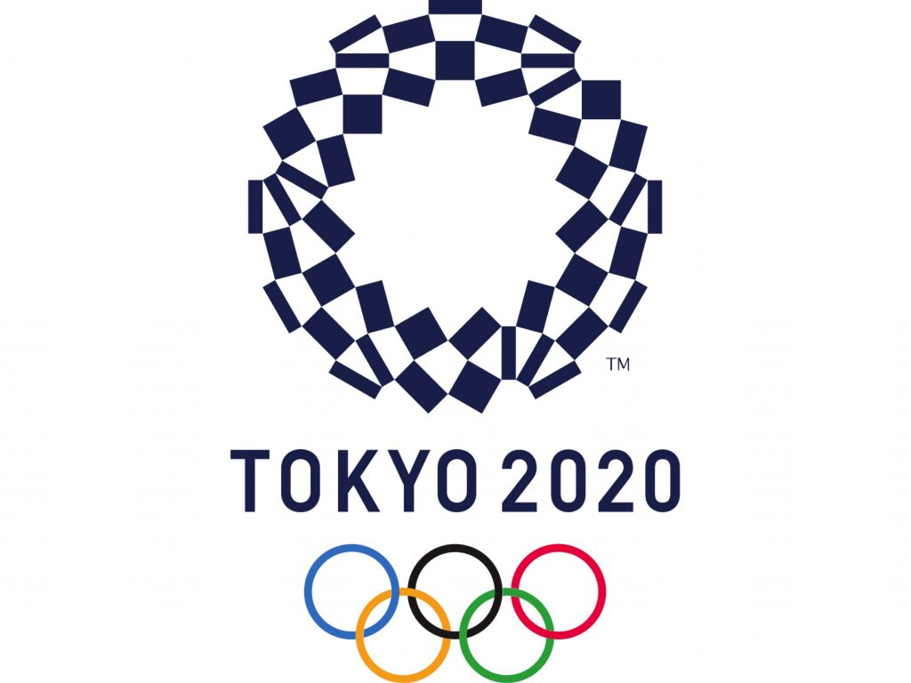
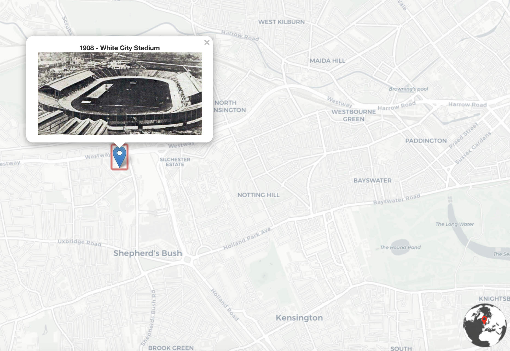
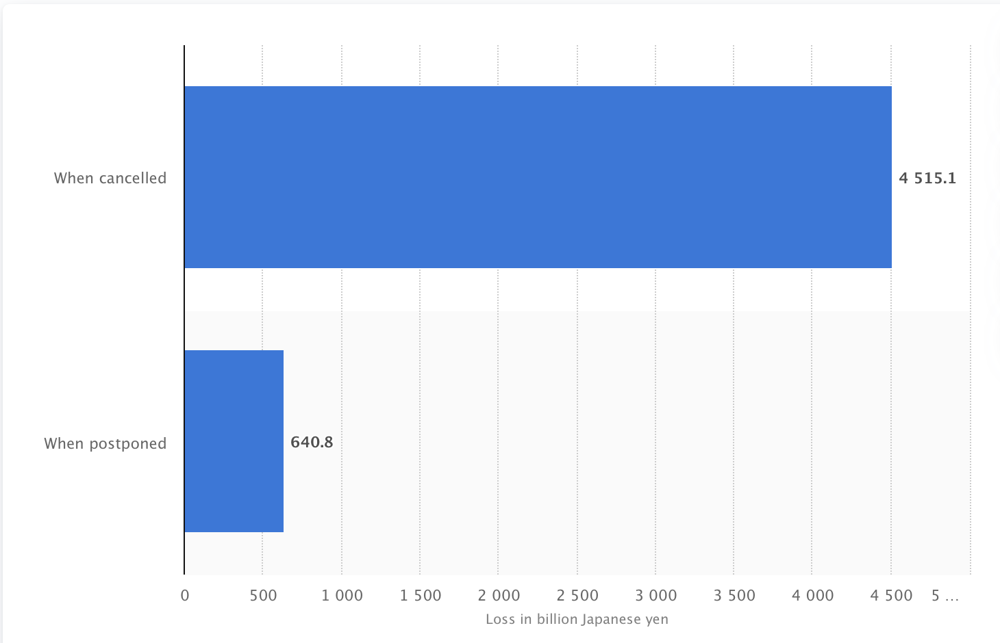

# Summer Olympic Games & Tokyo 2020 Olympic Games Postponed

###### Author: Amanda Kao

## Introduction

The goal of this project is to introduce the stadiums and the cities that have hosted the Summer Olympic Games in history from 1896. This July and August, one of the leading international sporting events should be host in Tokyo. Unfortunately, due to coronavirus, the event was postponed until next year. According to the report, the Olympics have never been delayed in their 124-year modern history, though they were canceled in 1916, 1940 and 1944 due to WWI and WWII.

This project isn't targeted any specific audience. I believed not everyone is into watching a sports game. However, when Olympic is happening, people will be influenced by the surrounding atmosphere and enthusiasm, wanting to support their own nations or athletes that they admire. Through my project, people can gain some knowledge about the history of the Summer Olympic games to modern days.

## Motivation

Despite telling the history of the Summer Olympic Games, I also want to analyze the impact of the postponement of the Olympic Games Tokyo 2020, from athletes, cities, to economics. Right now, the loss is already inevitable. Tokyo and the whole World are expecting the Olympic can be successfully held before next summer. Not every athlete has the next 4 years to wait.

## Methods

#### Systematic Architecture
- BaseMap
- Web Server
- File Server
- Web Browser

#### Applied libraries & Web Services
- Leaflet
- Github

### MAP
#### URL: https://amandakaoo.github.io/olympic/

Within over one century of history, the modern Olympic Games were born in Athens in 1896, featuring 280 participants from 30 nations. The history of the Olympics not only reflects its historical background but also some important movements from time to time, reaching and achieving the significance of the Olympic Spirit: the spirit of friendship, solidarity, and fair play.

##### History of Summer Olympic Games

In my map, there is a total of 31 points showing on the map. The points represent the location of the stadiums that have hosted or will host the Summer Olympic Games from 1896 to 2028.

- 1896  Athens, Greece
- 1900  Paris, France
- 1904  St. Louis, United States
- 1908  London, England
- 1912  Stockholm, Sweden
- 1920  Antwerp, Belgium
- 1924  Paris, France
- 1928  Amsterdam, Netherlands
- 1932  Los Angeles, United States
- 1936  Berlin, Germany
- 1948  London, England
- 1952  Helsinki, Finland
- 1956  Melbourne, Australia
- 1960  Rome, Italy
- 1964  Tokyo, Japan
- 1968  Mexico City, Mexico
- 1972  Munich, West Germany
- 1976  Montreal, Canada
- 1980  Moscow, Soviet Union
- 1984  Los Angeles, United States
- 1988  Seoul, South Korea
- 1992  Barcelona, Spain
- 1996  Atlanta, United States
- 2000  Sydney, Australia
- 2004  Athens, Greece
- 2008  Beijing, China
- 2012  London, England
- 2016  Rio de Janeiro, Brazil
- 2020  Tokyo, Japan
- 2024  Paris, France
- 2028  Los Angeles, United States

Pop-up windows will show up when viewers click on the points. The points represent the location of stadiums. Images and text display the historical background that happened during the Olympic Games. For example, women were allowed to take part for the first time in 1900. Berlin Olympics were the first to be televised to a limited audience under Hitler's regime in 1936. There were many historical moments happening in the Olympic Games.
I found the name of the stadiums from the official website of the Olympic Games. I input lists of year, city, and stadiums' names in Google Sheet. There is an add-on tool to help me geocode the Latitude and Longitude of the stadiums so that I can use it in further steps.

##### Tokyo 2020 Olympic Games Postponed

To relate to the recent news, it will be interesting to mention the postponement of the 2020 Tokyo Olympic Games. Maybe some of the people already knew some information from the internet or TV news. I will talk deeply within this topic from different perspectives that I collected from various media.

- Estimated Losses from 1-year postponement: $6 billion
- Estimated Losses if cancel: $37 billion
- Impact on a host of other major tournaments and sports
- Everything is uncertain
- Athletes Lives - health risks & disruption to their training
- Media: Sponsors & Advertisements
- etc.

## Data Sources
- Most of my data and sources are from https://www.olympic.org/olympic-games, the official website of the Olympic Games.
- https://www.britannica.com/sports/Olympic-Games
- https://www.britannica.com/sports/Olympic-Games/History-of-the-modern-Summer-Games
- BBC news
- The Asahi Shimbun http://www.asahi.com

